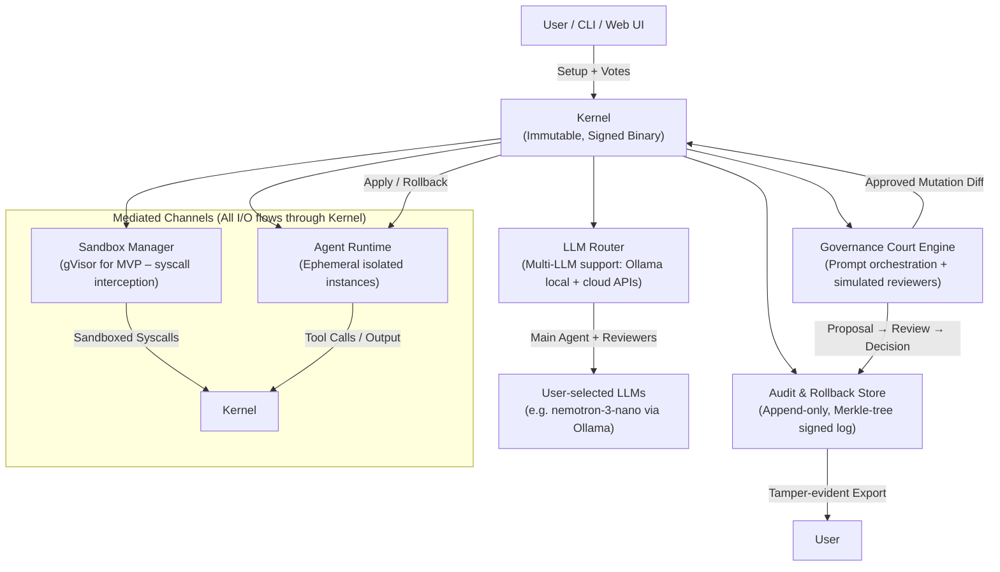

# AegisCourt – Architectural Decisions & High-Level Design
**Status:** Draft 
**Goal:** Define the minimal, secure-by-design structure for the AegisCourt seed kernel so implementation can begin without ambiguity. This is a living document; major decisions will be recorded as ADRs.

## 1. Core Design Principles (Non-Negotiable Invariants)
These must hold across every layer and every self-modification:

- **Least Privilege & Ephemeral Isolation** — Every agent, skill, reviewer, and tool runs in its own ephemeral sandbox with no shared memory/filesystem unless Court explicitly mediates a channel.
- **Cryptographic Immutability** — Kernel binary, constitution ruleset, every mutation (code/schema/rule), and audit log entry are cryptographically signed and versioned.
- **Bounded Autonomy** — No host I/O (file, network, process spawn) without explicit Governance Court go/no-go + user confirmation.
- **Defense-in-Depth** — Multi-layer protections: sandbox escape → kernel kill; prompt injection → multi-reviewer cross-check + evidence grounding.
- **Modularity & Observability** — Components are loosely coupled; every major action emits tamper-evident logs exportable to Prometheus/JSONL.
- **Hobbyist-First Performance** — Baseline <4 GB RAM (single-reviewer mode), <12 GB full Court, <45 sec Court round-trip on consumer hardware.

**Primary Threat Model** (prioritized):
1. Prompt injection / memory poisoning leading to unsafe self-mod
2. Sandbox escape → host compromise
3. Rogue LLM reviewer hallucination / bias
4. Supply-chain risk in user-selected LLMs
5. Resource exhaustion (DoS via many sandboxes)

## 2. High-Level Architecture Diagram

All communication between components is mediated by the Kernel. No direct agent-to-agent or agent-to-host access.
Human sign-offs (in Assisted/Hybrid/Manual modes) flow through the same mediated channel as user votes.

## 3. Key Architectural Decisions (ADRs)

### ADR-001: Isolation Technology (MVP Choice)
**Decision:** Use **gVisor** as primary sandboxing for Linux (syscall interception via userspace Sentry kernel).  
**Rationale:**  
- Stronger isolation than plain seccomp + namespaces (reimplements Linux syscalls in Go → reduces kernel attack surface).  
- Proven in production AI/agent contexts (e.g., Google Cloud Run, BentoRun, Northflank sandboxes 2026).  
- Better than Firecracker/Kata microVMs for hobbyist perf (milliseconds startup vs. seconds; lower RAM overhead).  
- seccomp/firejail fallback for non-Linux (macOS/Windows compatibility).  
**Status:** To validate in prototype (perf + escape resistance).

### ADR-002: LLM Routing & Multi-Model Support
**Decision:** Kernel maintains a config-driven router; main agent uses primary LLM; reviewers can use different models (or same with role prompts).  
**Rationale:** Enables supply-chain risk mitigation (e.g., flag Qwen; prefer nemotron-3-nano/llama3.x). Supports fallback / cross-check (multiple LLMs vote on risky proposals).  
**MVP:** Ollama local endpoint + HTTP APIs (OpenAI/Claude/Grok compatible).

### ADR-003: Audit Log Format & Tamper-Proofing
**Decision:** Append-only log using **Merkle tree** + Ed25519 signatures per entry + periodic root-hash signing.  
**Rationale:**  
- Merkle tree enables efficient membership proofs + tamper detection (standard in verifiable logs 2025–2026).  
- Each entry: UUIDv7 ID, timestamp, hash(prev), payload hash, signature, Merkle proof path.  
- Exportable JSONL + root-hash commitments for external verification.  
**Alternative considered:** Simple signed append-only SQLite → rejected (harder to prove consistency across snapshots).

### ADR-004: Self-Modification Application Model
**Decision:** Mutations proposed as Git-like diffs (JSON patch + code deltas); Court approves → Kernel applies atomically or rolls back.  
**Rationale:** Reversible, auditable, versioned. Constitution itself is a mutable-but-Court-gated file inside the immutable kernel.

### ADR-005: Resource Bounding & Fallbacks
**Decision:** Sandbox Manager enforces cgroupv2 limits + CPU/memory caps per sandbox. Full Court fallback to single-reviewer mode if RAM <8 GB detected.  
**Rationale:** Prevents hobbyist laptop DoS; keeps baseline usable.

### ADR-006: Governance Court Modes & Human-in-the-Loop Variability
**Decision:** The Governance Court Engine supports four operational modes (Hobbyist Auto, Indie Assisted, Team Hybrid, Enterprise Manual), selected via About Me profile / config.

### ADR-011: Reviewer Output Schema
**Decision:** The single source of truth is in `pkg/court/reviewers/schema.json`.

**Rationale:**
- Enables graduated trust: fast automated flow for hobbyists; structured human oversight for enterprises.
- Preserves security invariants — all modes require proposal logging, reversibility, and kernel mediation.
- Allows configurable reviewer depth (e.g. full 6-persona panel vs. fallback 1–2 in low-RAM Hobbyist mode).
- Human sign-offs recorded as signed audit entries with domain (CISO/MRM/etc.) and user identity.

**Implementation Notes (MVP):**
- Mode stored in kernel config; changes to stricter modes require Court approval.
- In Manual/Hybrid modes, Court Engine pauses at “pending human signoff” state until `court signoff` commands complete required domains.
- Audit entries include: `court_mode`, `human_review_status` (None/Pending/Partial/Complete), `signoff_domains` array.
- Fallback: if mode=auto and RAM low → reduce to single-reviewer or batched LLM calls.

**Status:** To prototype mode switching latency and signoff state machine.

## 4. Component Responsibilities Table

| Component              | Primary Responsibility                          | Security Invariant Enforced                  | MVP Tech Choices                  |
|------------------------|-------------------------------------------------|----------------------------------------------|-----------------------------------|
| Kernel                 | Bootstrap, mediation, signing                   | Immutability, least privilege                | Go (strong typing + crypto)       |
| Sandbox Manager        | Spawn/isolate sandboxes                         | Ephemeral isolation, syscall filtering       | gVisor (Linux); seccomp fallback  |
| LLM Router             | Route prompts, manage keys/endpoints            | Supply-chain risk flagging                   | HTTP client + Ollama integration  |
| Governance Court Engine| Orchestrate reviewers, collect decisions, **adapt behavior per Court mode (reviewer count, human signoff gating, auto-apply thresholds)** | Bounded autonomy, multi-viewpoint reasoning, **human sovereignty per profile** | Prompt templates + multi-LLM + **state machine for pending signoffs** |
| Audit & Rollback Store | Immutable logging + rollback snapshots          | Tamper-evident history                       | Merkle tree + Ed25519             |
| Agent Runtime          | Execute approved agent loops                    | No direct host access                        | Ephemeral gVisor sandboxes        |

## 5. Open Architectural Questions
- Exact gVisor config profile (syscall allowlist size vs. perf trade-off)?
- Number of default reviewer personas (4–6) and their prompt templates?
- First dogfood self-mod: agent improving its own tool-calling prompt?
- macOS/Windows sandbox fallback strategy (Seatbelt / AppContainer)?
- Merkle tree root-hash commitment frequency (per-entry vs. batch)?
- How to persist and recover pending human signoff state across kernel restarts (e.g. serialized in Audit Store)?
- Authentication/identity mechanism for multi-user signoffs in Hybrid/Manual modes (MVP: simple --user flag; Phase 2: key-based or OAuth-lite)?
- Performance impact of mode-aware reviewer orchestration (e.g. parallel LLM calls in full panel vs. sequential in low-resource mode)?
- Visualization of signoff progress in audit exports / snapshots (for compliance mapping in Enterprise mode)?

Link back to [PRD.md](../PRD.md) for full context.

Next version (v0.2) will incorporate prototype learnings (perf numbers, isolation escape tests, etc.).

Next version will incorporate prototype learnings (perf numbers, isolation escape tests, **Court mode state transitions**, signoff latency).
